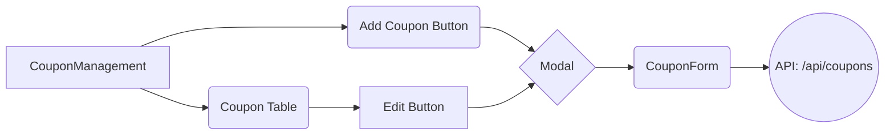

# Coupon Management Redesign Plan

This document outlines the plan to refactor the coupon management UI to use modals for editing and creating coupons.

## Goals

*   Improve the user experience by using modals for editing and creating coupons.
*   Create a reusable `CouponForm` component.
*   Simplify the state management in the `CouponManagement` component.

## Plan

**1. Create a Separate Component for the Coupon Form:**

*   Extract the existing form from the `CouponManagement` component into a new component named `CouponForm`.
*   The `CouponForm` component will receive the following props:
    *   `coupon`: (optional) The coupon data to edit. If null, it's a create operation.
    *   `onSave`: A callback function to handle saving the coupon (both create and update).
    *   `onCancel`: A callback function to handle canceling the form.
    *   `isLoading`: A boolean to indicate whether the form is in a loading state.

**2. Implement the "Add Coupon" Button and Modal:**

*   Add a new button in the `CouponManagement` component labeled "Add Coupon".
*   This button will trigger the opening of a modal (using the `Dialog` component from Shadcn UI).
*   The modal will contain the `CouponForm` component, initially with no `coupon` prop (indicating a create operation).

**3. Implement the Edit Functionality with a Modal:**

*   Modify the existing "Edit" button in the table.
*   Instead of directly setting the state in `CouponManagement`, it will trigger the opening of a modal.
*   The modal will contain the `CouponForm` component, passing the selected `coupon` data as a prop.

**4. Handle Form Submission (Create and Update):**

*   The `CouponForm` component will handle form submission internally.
*   On submission, it will call the `onSave` prop with the coupon data.
*   The `onSave` callback (a function defined in `CouponManagement`) will make the API call (POST for create or PUT for update).

**5. State Management:**

*   The `CouponManagement` component will manage the list of `coupons`.
*   It will also manage the state for the modal's open/closed state.
*   The `editingCoupon` state will no longer be necessary.

**6. API Interaction:**

*   The API interaction will remain largely the same, but will be triggered by the `onSave` callback from `CouponForm`.

**7. Loading State:**

*   The `loading` state will disable the form's submit button during API calls.

**8. Error Handling:**

*   Error messages will be displayed within the modal.

## Component Structure (Mermaid Diagram):



## Flow (Mermaid Diagram):

```mermaid
sequenceDiagram
    participant User
    participant CouponManagement
    participant CouponForm
    participant API

    User->>CouponManagement: Clicks "Add Coupon"
    CouponManagement->>CouponManagement: Opens Modal
    CouponManagement->>CouponForm: Renders CouponForm (create mode)
    User->>CouponForm: Fills form
    CouponForm->>CouponManagement: Calls onSave (create)
    CouponManagement->>API: POST /api/coupons
    API-->>CouponManagement: Response
    CouponManagement->>CouponForm: Updates UI (success/error)
    CouponManagement->>CouponManagement: Closes Modal (on success)

    User->>CouponManagement: Clicks "Edit"
    CouponManagement->>CouponManagement: Opens Modal
    CouponManagement->>CouponForm: Renders CouponForm (edit mode)
    User->>CouponForm: Edits form
    CouponForm->>CouponManagement: Calls onSave (update)
    CouponManagement->>API: PUT /api/coupons/[id]
    API-->>CouponManagement: Response
    CouponManagement->>CouponForm: Updates UI (success/error)
    CouponManagement->>CouponManagement: Closes Modal (on success)